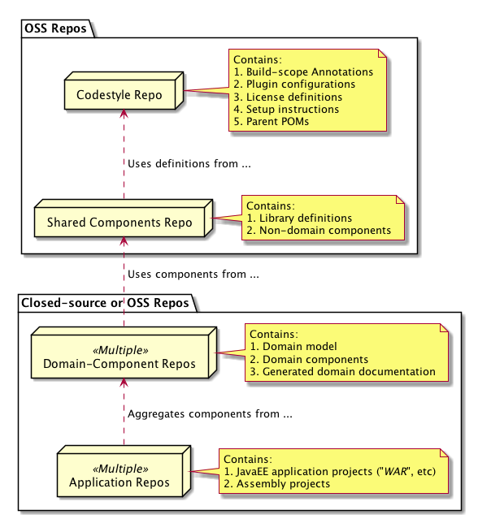

# What are _Shared Components_?

This repository contains technology-aware artifacts and helper components without any domain information.
Hence, all "shared" components are intended for deployment into production, and also potential OSS access.
Mainly, shared components include

1. **Service Provider Interface**s (SPIs): Typically used to hold internally used, public specifications. 
2. **Test-scope Artifacts**: Components intended to simplify test automation in other projects.
3. **Helper Components**: Full software components which are independent of domain, such as 
   microservice underpinnings / distributions.
   
A Shared Components repository, therefore, depends mainly on build definitions, annotations and configuration 
supplied within the Shared Components repository in addition to the standards (typically `JavaEE` or `EE4J`) or 
chosen technology stack (something like `Apache Camel` or `Spring Framework`). The intended structure and 
responsibilities of projects/artifacts within repositories could/should be ordered as illustrated in the image below:

   

## Using shared artifacts

The artifacts produced within the Shared repository should be included as dependencies 
within your repositories and artifact projects. Typically, the usage is limited to 
`dependency` elements within the consuming POM. 

It is recommended to define at least 3 properties:

1. **`jguru-shared.version`**: Contains the (release) version of 
   the jGuru shared components. Use that property for all dependencies within the consuming POM to ensure
   that all shared components stem from the same release. Semantic versioning applies.
2. **`reactor.name`**: Directory name which should be identical for all Maven projects within a repository. 
   This name is used to synthesize the staging site path (`/tmp/${reactor.name}/${version}`) which 
   enables deploying and serving documentation for several repositories/products and release versions in parallel.
3. **`path.in.reactor`**: Forward-slash-separated path to the directory of the consuming POM, calculated from the 
   repository root. Hence - within the snippet below, the consuming POM should be found at path 
   `/somecomponent/sompcomponent-api` within the repo. This is used to help the maven-site-plugin structure 
   generated documentation properly.
          
These recommendations are illustrated within the POM snippet below:

    <!-- +=============================================== -->
    <!-- | Section 1:  Property definitions               -->
    <!-- +=============================================== -->
    <properties>
        
        <!-- Artifact-related properties. -->
        <jguru-shared.version>4.5.6</jguru-shared.version>
        
        ...
        
        <!-- Properties for building Documentation. (example from consuming POM) -->
        <path.in.reactor>somecomponent/somecomponent-api</path.in.reactor>
        <reactor.name>acmecorp-somelib</reactor.name>
    </properties>

    <!-- +=============================================== -->
    <!-- | Section 2:  Dependency (management) settings   -->
    <!-- +=============================================== -->
    <dependencies>
    
        <!-- Compile-scope dependencies -->
        <dependency>
            <groupId>com.jguru.shared.algorithms.api</groupId>
            <artifactId>jguru-shared-algorithms-api</artifactId>
            <version>${jguru-shared.version}</version>
        </dependency>
        
        <!-- Test-scope dependencies -->
        <dependency>
            <groupId>com.jguru.shared.marshalling.test</groupId>
            <artifactId>jguru-shared-marshalling-test</artifactId>
            <version>${jguru-shared.version}</version>
            <scope>test</scope>
        </dependency>        
    </dependencies>
    
All shared components should be included using the same version.    

# Building the shared components

The shared components repository is built using [Maven](http://maven.apache.org/) and Java 8.
Support for Java 9 and Java 10 is pending, and will be included in a future release. 
All artifacts can be built using the standard Maven commands:

	mvn clean install
	
### Building the Documentation

The standard documentation is built using [Maven Site Plugin](https://maven.apache.org/plugins/maven-site-plugin/) 
mechanics - we use [Markdown](https://daringfireball.net/projects/markdown/syntax) with the added capabilities 
of [PlantUML](http://plantuml.com/) diagrams to render diagrams when needed.

This requires you to install a `dot` executable normally found within the [Graphviz](http://graphviz.org) open-source 
application. Simply download and install it within the standard path on your workstation to be able to build the 
documentation and all its diagrams properly.  

After graphviz/dot is installed, simply build the documentation using:

	mvn site
	
Build the staged documentation for all modules using:

	mvn site site:stage	
	
The staged documentation should land within the `/tmp/${reactor.name}/${version}` directory - typically something like
`/tmp/jguru_shared/1.2.3/`. 

